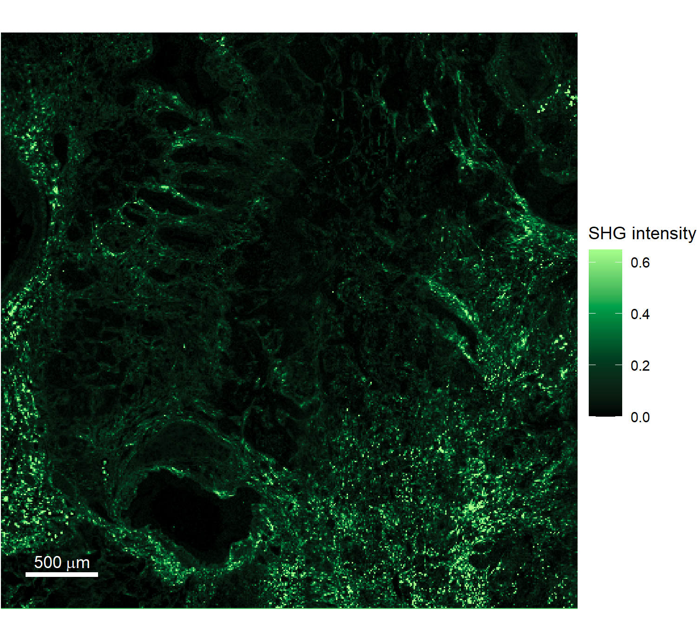
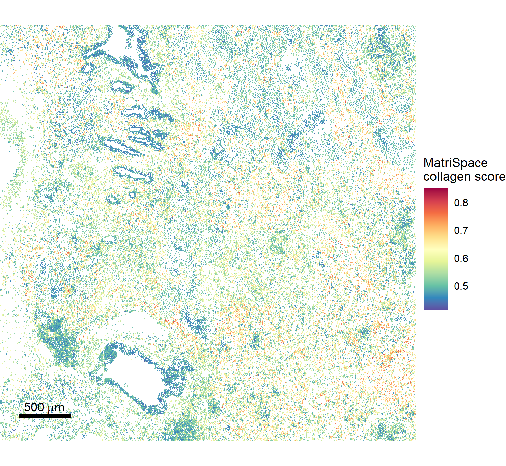
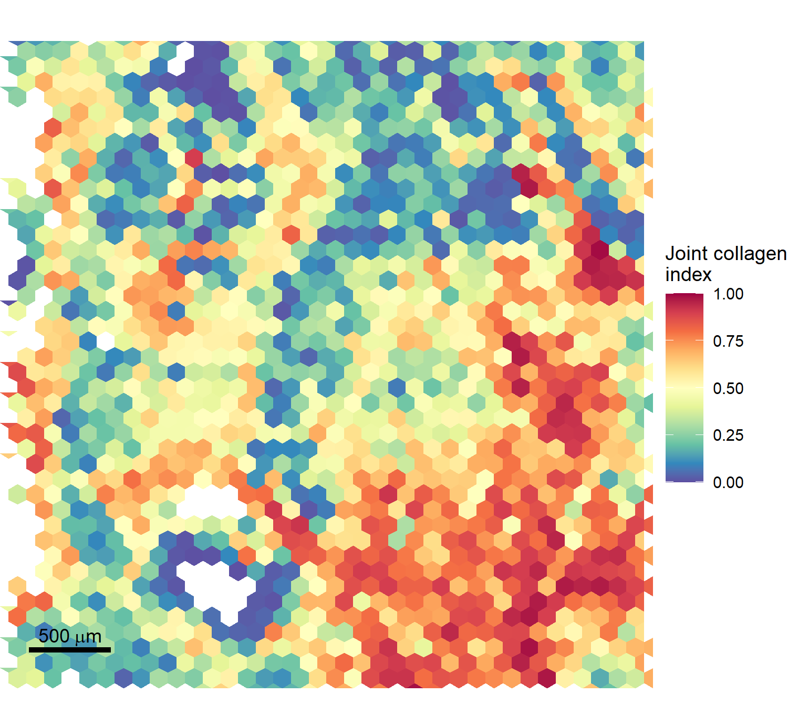
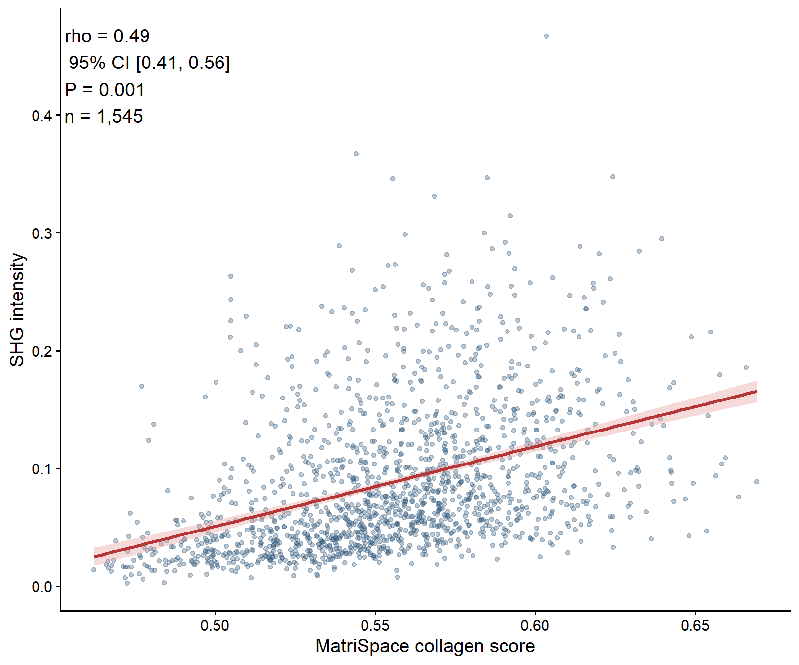

## CosMx collagen scores


``` r
expression_file <- file.path(
  params$data_dir,
  "cosmx_section04",
  "Run1129_Section_04_exprMat_file.csv"
)
alignment_file <- file.path(params$data_dir, "shg", "section4_aligned_metadata.csv")
collagen_file <- file.path(params$data_dir, "shg", "Collagen.tif")

expression <- fread(expression_file)
expression <- expression[cell_ID != 0]
expression[, barcode := sprintf("section_4_fov_%s_ID_%s", fov, cell_ID)]
alignment <- fread(alignment_file)

# Retain the cells present in the deposited adjacent-section alignment.
expression <- expression[match(alignment$barcode, expression$barcode)]
stopifnot(identical(expression$barcode, alignment$barcode))

id_columns <- c("fov", "cell_ID", "barcode")
features <- setdiff(names(expression), id_columns)
controls <- grep(
  "^(NegPrb|Negative|SystemControl|FalseCode|Control)",
  features,
  value = TRUE,
  ignore.case = TRUE
)
genes <- setdiff(features, controls)

counts <- t(as.matrix(expression[, ..genes]))
storage.mode(counts) <- "double"
counts <- methods::as(Matrix(counts, sparse = TRUE), "dgCMatrix")
rownames(counts) <- genes
colnames(counts) <- alignment$barcode
rm(expression)
invisible(gc())

shg <- readTIFF(collagen_file, native = FALSE, as.is = TRUE)
if (length(dim(shg)) == 3) shg <- shg[, , 1]
storage.mode(shg) <- "double"

# Map aligned cell coordinates to the 4,000-µm SHG field.
x_fraction <- (alignment$xc - min(alignment$xc)) / diff(range(alignment$xc))
y_fraction <- (alignment$yc - min(alignment$yc)) / diff(range(alignment$yc))
alignment[, image_x := 1 + (1 - x_fraction) * (ncol(shg) - 1)]
alignment[, image_y := 1 + y_fraction * (nrow(shg) - 1)]
alignment[, x_um := (image_x - 1) * 4000 / ncol(shg)]
alignment[, y_um := (image_y - 1) * 4000 / ncol(shg)]

metadata <- data.frame(
  x_um = alignment$x_um,
  y_um = alignment$y_um,
  row.names = alignment$barcode
)

seu <- CreateSeuratObject(
  counts = counts,
  assay = "Spatial",
  meta.data = metadata,
  min.cells = 1,
  min.features = 0,
  project = "LUAD_SHG_CosMx_validation"
)
rm(counts)
invisible(gc())

seu <- SCTransform(
  seu,
  assay = "Spatial",
  new.assay.name = "SCT",
  do.correct.umi = TRUE,
  return.only.var.genes = FALSE,
  conserve.memory = TRUE,
  verbose = FALSE
)

collagen_genes <- matrisome_signatures[["collagens"]]
sct_data <- LayerData(seu, assay = "SCT", layer = "data")
measured_collagens <- intersect(collagen_genes, rownames(sct_data))

seu <- score_matrisome(
  seu,
  include = "collagens",
  assay = "SCT",
  layer = "data",
  min_genes = 1,
  maxRank = 1500,
  overwrite = TRUE
)
collagen_scores <- as.numeric(
  get_matrisome_scores(seu, signatures = "collagens")[
    "collagens", colnames(seu)
  ]
)

cells <- data.table(
  barcode = colnames(seu),
  x_um = seu$x_um,
  y_um = seu$y_um,
  nFeature_Spatial = seu$nFeature_Spatial,
  collagen_score = collagen_scores
)

coverage <- data.frame(
  signature = "collagens",
  requested_genes = length(collagen_genes),
  measured_genes = length(measured_collagens),
  coverage_fraction = length(measured_collagens) / length(collagen_genes)
)
write.csv(coverage, "results/signature_coverage.csv", row.names = FALSE)
coverage
```

```
##   signature requested_genes measured_genes coverage_fraction
## 1 collagens              44             25         0.5681818
```

## Area-matched hexagons


``` r
field_width <- 4000
pixel_size <- field_width / ncol(shg)
xbins <- 37L
minimum_cells <- 10L

cell_hexbin <- hexbin(
  cells$x_um,
  cells$y_um,
  xbins = xbins,
  xbnds = c(0, field_width),
  ybnds = c(0, field_width),
  shape = 1,
  IDs = TRUE
)

cell_summary <- data.table(
  hex_id = cell_hexbin@cID,
  collagen_score = cells$collagen_score,
  nFeature_Spatial = cells$nFeature_Spatial
)[, .(
  n_cells = .N,
  collagen_score = mean(collagen_score),
  nFeature_Spatial = mean(nFeature_Spatial)
), by = hex_id]

hex_centres <- hcell2xy(cell_hexbin)
centres <- data.table(
  hex_id = cell_hexbin@cell,
  x_um = hex_centres$x,
  y_um = hex_centres$y
)

# Assign every SHG pixel to the same hexagonal grid.
x_coordinates <- (seq_len(ncol(shg)) - 0.5) * pixel_size
y_coordinates <- (seq_len(nrow(shg)) - 0.5) * pixel_size
shg_points <- data.table(
  x_um = rep(x_coordinates, each = nrow(shg)),
  y_um = rep(y_coordinates, times = ncol(shg)),
  intensity = as.vector(shg / max(shg))
)

shg_hexbin <- hexbin(
  shg_points$x_um,
  shg_points$y_um,
  xbins = xbins,
  xbnds = c(0, field_width),
  ybnds = c(0, field_width),
  shape = 1,
  IDs = TRUE
)

shg_summary <- data.table(
  hex_id = shg_hexbin@cID,
  intensity = shg_points$intensity
)[, .(shg_mean = mean(intensity)), by = hex_id]
rm(shg_points)
invisible(gc())

hexagons <- merge(cell_summary, shg_summary, by = "hex_id")
hexagons <- merge(hexagons, centres, by = "hex_id")
hexagons <- hexagons[n_cells >= minimum_cells]

horizontal_width <- field_width / xbins
hex_side <- horizontal_width / sqrt(3)
hex_height <- 2 * hex_side
row_spacing <- 1.5 * hex_side
hex_area <- sqrt(3) / 2 * horizontal_width^2

hexagons[, cosmx_percentile := (frank(collagen_score) - 0.5) / .N]
hexagons[, shg_percentile := (frank(shg_mean) - 0.5) / .N]
hexagons[, joint_collagen_index :=
  2 * cosmx_percentile * shg_percentile /
  (cosmx_percentile + shg_percentile)]

# Axial coordinates preserve the hexagonal topology for spatial shifts.
hexagons[, hex_row := as.integer(round(y_um / row_spacing))]
hexagons[, hex_col := as.integer(round(
  (x_um - (hex_row %% 2L) * horizontal_width / 2) / horizontal_width
))]
hexagons[, axial_q := hex_col - ((hex_row - (hex_row %% 2L)) %/% 2L)]
hexagons[, axial_q_mod := axial_q %% cell_hexbin@dimen[[2L]]]
```

## Spatial association


``` r
spearman <- function(x, y) {
  cor(x, y, method = "spearman", use = "complete.obs")
}

partial_spearman <- function(x, y, covariates) {
  ranked_covariates <- as.data.frame(lapply(as.data.frame(covariates), rank))
  x_residual <- resid(lm(rank(x) ~ ., data = ranked_covariates))
  y_residual <- resid(lm(rank(y) ~ ., data = ranked_covariates))
  cor(x_residual, y_residual)
}

observed <- spearman(hexagons$collagen_score, hexagons$shg_mean)

# Bootstrap 400-µm spatial blocks.
bootstrap_data <- copy(hexagons)
bootstrap_data[, block := paste(floor(x_um / 400), floor(y_um / 400), sep = "_")]
rows_by_block <- split(seq_len(nrow(bootstrap_data)), bootstrap_data$block)
blocks <- names(rows_by_block)
set.seed(15240532)
bootstrap_correlations <- replicate(1000, {
  sampled_blocks <- sample(blocks, length(blocks), replace = TRUE)
  rows <- unlist(rows_by_block[sampled_blocks], use.names = FALSE)
  spearman(bootstrap_data$collagen_score[rows], bootstrap_data$shg_mean[rows])
})
confidence_interval <- quantile(
  bootstrap_correlations,
  c(0.025, 0.975),
  type = 8
)

# Shift the SHG field while preserving its internal spatial structure.
ny <- cell_hexbin@dimen[[1L]]
nx <- cell_hexbin@dimen[[2L]]
score_matrix <- matrix(NA_real_, nrow = ny, ncol = nx)
shg_matrix <- matrix(NA_real_, nrow = ny, ncol = nx)
matrix_index <- cbind(hexagons$hex_row + 1L, hexagons$axial_q_mod + 1L)
score_matrix[matrix_index] <- hexagons$collagen_score
shg_matrix[matrix_index] <- hexagons$shg_mean

set.seed(15240633)
shifts <- data.table(
  row_shift = sample.int(ny, 999, replace = TRUE) - 1L,
  column_shift = sample.int(nx, 999, replace = TRUE) - 1L
)
zero_shift <- shifts$row_shift == 0L & shifts$column_shift == 0L
while (any(zero_shift)) {
  shifts$row_shift[zero_shift] <- sample.int(ny, sum(zero_shift), replace = TRUE) - 1L
  shifts$column_shift[zero_shift] <- sample.int(nx, sum(zero_shift), replace = TRUE) - 1L
  zero_shift <- shifts$row_shift == 0L & shifts$column_shift == 0L
}

null_correlations <- vapply(seq_len(nrow(shifts)), function(i) {
  rows <- ((seq_len(ny) - 1L + shifts$row_shift[i]) %% ny) + 1L
  columns <- ((seq_len(nx) - 1L + shifts$column_shift[i]) %% nx) + 1L
  spearman(as.vector(score_matrix), as.vector(shg_matrix[rows, columns, drop = FALSE]))
}, numeric(1))

p_value <- (1 + sum(abs(null_correlations) >= abs(observed), na.rm = TRUE)) /
  (1 + sum(is.finite(null_correlations)))

adjusted_correlation <- partial_spearman(
  hexagons$collagen_score,
  hexagons$shg_mean,
  hexagons[, .(n_cells, nFeature_Spatial)]
)

inference <- data.frame(
  spatial_unit = "area-matched regular hexagon",
  hex_area_um2 = hex_area,
  minimum_cells = minimum_cells,
  retained_hexagons = nrow(hexagons),
  spearman = observed,
  confidence_interval_low = confidence_interval[1],
  confidence_interval_high = confidence_interval[2],
  circular_shift_p = p_value,
  adjusted_spearman = adjusted_correlation
)

fwrite(hexagons, "results/hexagon_data.csv.gz")
write.csv(inference, "results/spatial_inference.csv", row.names = FALSE)
write.csv(data.frame(bootstrap_spearman = bootstrap_correlations),
          "results/block_bootstrap.csv", row.names = FALSE)
write.csv(data.frame(null_spearman = null_correlations),
          "results/spatial_shift_null.csv", row.names = FALSE)

run_metadata <- data.frame(
  field = c(
    "seed", "cells", "genes", "field_width_um", "x_bins", "minimum_cells",
    "bootstrap_replicates", "shift_replicates", "R", "matrispace", "Seurat", "UCell"
  ),
  value = c(
    15240431, ncol(seu), nrow(seu), field_width, xbins, minimum_cells,
    length(bootstrap_correlations), length(null_correlations),
    as.character(getRversion()), as.character(packageVersion("matrispace")),
    as.character(packageVersion("Seurat")),
    as.character(packageVersion("UCell"))
  )
)
write.csv(run_metadata, "results/run_metadata.csv", row.names = FALSE)
inference
```

```
##                      spatial_unit hex_area_um2 minimum_cells retained_hexagons
## 2.5% area-matched regular hexagon     10121.55            10              1545
##      spearman confidence_interval_low confidence_interval_high circular_shift_p
## 2.5% 0.489245               0.4081825                0.5589758            0.001
##      adjusted_spearman
## 2.5%          0.478715
```

## Spatial maps


``` r
plot_rows <- seq(1, nrow(shg), by = 3)
plot_columns <- seq(1, ncol(shg), by = 3)
shg_plot_data <- CJ(row = plot_rows, column = plot_columns)
shg_plot_data[, intensity := shg[cbind(row, column)] / max(shg)]
shg_plot_data[, x_um := (column - 0.5) * pixel_size]
shg_plot_data[, y_um := (row - 0.5) * pixel_size]
display_limit <- quantile(shg_plot_data$intensity, 0.995)

shg_map <- ggplot(shg_plot_data, aes(x_um, y_um, fill = pmin(intensity, display_limit))) +
  geom_raster() +
  scale_fill_gradientn(
    colours = c("#000000", "#003B1F", "#00A34A", "#A6FF8B"),
    limits = c(0, display_limit),
    name = "SHG intensity"
  ) +
  spatial_coordinates +
  map_theme
add_scale_bar(shg_map, "white")
```




``` r
cosmx_map <- ggplot(cells, aes(x_um, y_um, colour = collagen_score)) +
  geom_point(size = 0.12, alpha = 0.9) +
  scale_colour_gradientn(colours = collagen_palette, name = "MatriSpace\ncollagen score") +
  spatial_coordinates +
  map_theme
add_scale_bar(cosmx_map)
```




``` r
angles <- pi / 6 + (0:5) * pi / 3
vertices <- data.table(
  vertex = 1:6,
  dx = hex_side * cos(angles),
  dy = hex_side * sin(angles)
)
hexagon_polygons <- hexagons[, .(
  vertex = vertices$vertex,
  x = x_um + vertices$dx,
  y = y_um + vertices$dy,
  joint_collagen_index = joint_collagen_index
), by = hex_id]

joint_map <- ggplot(
  hexagon_polygons,
  aes(x, y, group = hex_id, fill = joint_collagen_index)
) +
  geom_polygon(colour = NA) +
  scale_fill_gradientn(
    colours = collagen_palette,
    limits = c(0, 1),
    name = "Joint collagen\nindex"
  ) +
  spatial_coordinates +
  map_theme
add_scale_bar(joint_map)
```




``` r
ggplot(hexagons, aes(collagen_score, shg_mean)) +
  geom_point(colour = "#355C7D", alpha = 0.32, size = 0.85) +
  geom_smooth(
    method = "lm",
    formula = y ~ x,
    colour = "#B53636",
    fill = "#E9A1A1",
    linewidth = 0.8
  ) +
  annotate(
    "text",
    x = -Inf,
    y = Inf,
    hjust = -0.05,
    vjust = 1.2,
    label = sprintf(
      "rho = %.2f\n95%% CI [%.2f, %.2f]\nP = %.3f\nn = %s",
      observed,
      confidence_interval[1],
      confidence_interval[2],
      p_value,
      format(nrow(hexagons), big.mark = ",")
    ),
    size = 3.2
  ) +
  labs(x = "MatriSpace collagen score", y = "SHG intensity") +
  theme_classic(base_size = 9)
```



## Session information


``` r
sessionInfo()
```

```
## R version 4.5.3 (2026-03-11 ucrt)
## Platform: x86_64-w64-mingw32/x64
## Running under: Windows 11 x64 (build 26200)
##
## Matrix products: default
##   LAPACK version 3.12.1
##
## locale:
## [1] C
## system code page: 65001
##
## time zone: Europe/Helsinki
## tzcode source: internal
##
## attached base packages:
## [1] stats     graphics  grDevices utils     datasets  methods   base
##
## other attached packages:
##  [1] future_1.70.0      tiff_0.1-12        hexbin_1.28.5      data.table_1.18.4
##  [5] Seurat_5.5.0       SeuratObject_5.4.0 sp_2.2-1           Matrix_1.7-4
##  [9] matrispace_0.3.0   ggplot2_4.0.3
##
## loaded via a namespace (and not attached):
##   [1] RColorBrewer_1.1-3          UCell_2.14.0
##   [3] jsonlite_2.0.0              magrittr_2.0.5
##   [5] spatstat.utils_3.2-3        farver_2.1.2
##   [7] vctrs_0.7.3                 ROCR_1.0-12
##   [9] DelayedMatrixStats_1.32.0   spatstat.explore_3.8-0
##  [11] htmltools_0.5.9             S4Arrays_1.10.1
##  [13] BiocNeighbors_2.4.0         SparseArray_1.10.10
##  [15] sctransform_0.4.3           parallelly_1.47.0
##  [17] KernSmooth_2.23-26          htmlwidgets_1.6.4
##  [19] ica_1.0-3                   plyr_1.8.9
##  [21] plotly_4.12.0               zoo_1.8-15
##  [23] igraph_2.3.1                mime_0.13
##  [25] lifecycle_1.0.5             pkgconfig_2.0.3
##  [27] R6_2.6.1                    fastmap_1.2.0
##  [29] MatrixGenerics_1.22.0       fitdistrplus_1.2-6
##  [31] shiny_1.13.0                digest_0.6.39
##  [33] patchwork_1.3.2             S4Vectors_0.48.1
##  [35] tensor_1.5.1                RSpectra_0.16-2
##  [37] irlba_2.3.7                 GenomicRanges_1.62.1
##  [39] beachmat_2.26.0             labeling_0.4.3
##  [41] progressr_0.19.0            spatstat.sparse_3.2-0
##  [43] mgcv_1.9-4                  httr_1.4.8
##  [45] polyclip_1.10-7             abind_1.4-8
##  [47] compiler_4.5.3              withr_3.0.2
##  [49] S7_0.2.2                    BiocParallel_1.44.0
##  [51] fastDummies_1.7.6           MASS_7.3-65
##  [53] DelayedArray_0.36.1         tools_4.5.3
##  [55] lmtest_0.9-40               otel_0.2.0
##  [57] httpuv_1.6.17               future.apply_1.20.2
##  [59] goftest_1.2-3               glmGamPoi_1.22.0
##  [61] glue_1.8.1                  nlme_3.1-168
##  [63] promises_1.5.0              grid_4.5.3
##  [65] Rtsne_0.17                  cluster_2.1.8.2
##  [67] reshape2_1.4.5              generics_0.1.4
##  [69] gtable_0.3.6                spatstat.data_3.1-9
##  [71] tidyr_1.3.2                 XVector_0.50.0
##  [73] BiocGenerics_0.56.0         spatstat.geom_3.8-1
##  [75] RcppAnnoy_0.0.23            ggrepel_0.9.8
##  [77] RANN_2.6.2                  pillar_1.11.1
##  [79] stringr_1.6.0               spam_2.11-3
##  [81] RcppHNSW_0.6.0              later_1.4.8
##  [83] splines_4.5.3               dplyr_1.2.1
##  [85] lattice_0.22-9              survival_3.8-6
##  [87] deldir_2.0-4                tidyselect_1.2.1
##  [89] SingleCellExperiment_1.32.0 miniUI_0.1.2
##  [91] pbapply_1.7-4               knitr_1.51
##  [93] gridExtra_2.3               IRanges_2.44.0
##  [95] Seqinfo_1.0.0               SummarizedExperiment_1.40.0
##  [97] scattermore_1.2             stats4_4.5.3
##  [99] xfun_0.57                   Biobase_2.70.0
## [101] matrixStats_1.5.0           stringi_1.8.7
## [103] lazyeval_0.2.3              yaml_2.3.12
## [105] evaluate_1.0.5              codetools_0.2-20
## [107] tibble_3.3.1                cli_3.6.6
## [109] uwot_0.2.4                  xtable_1.8-8
## [111] reticulate_1.46.0           dichromat_2.0-0.1
## [113] Rcpp_1.1.1-1.1              globals_0.19.1
## [115] spatstat.random_3.4-5       png_0.1-9
## [117] spatstat.univar_3.2-0       parallel_4.5.3
## [119] dotCall64_1.2               sparseMatrixStats_1.22.0
## [121] listenv_0.10.1              viridisLite_0.4.3
## [123] scales_1.4.0                ggridges_0.5.7
## [125] purrr_1.2.2                 rlang_1.2.0
## [127] cowplot_1.2.0
```
