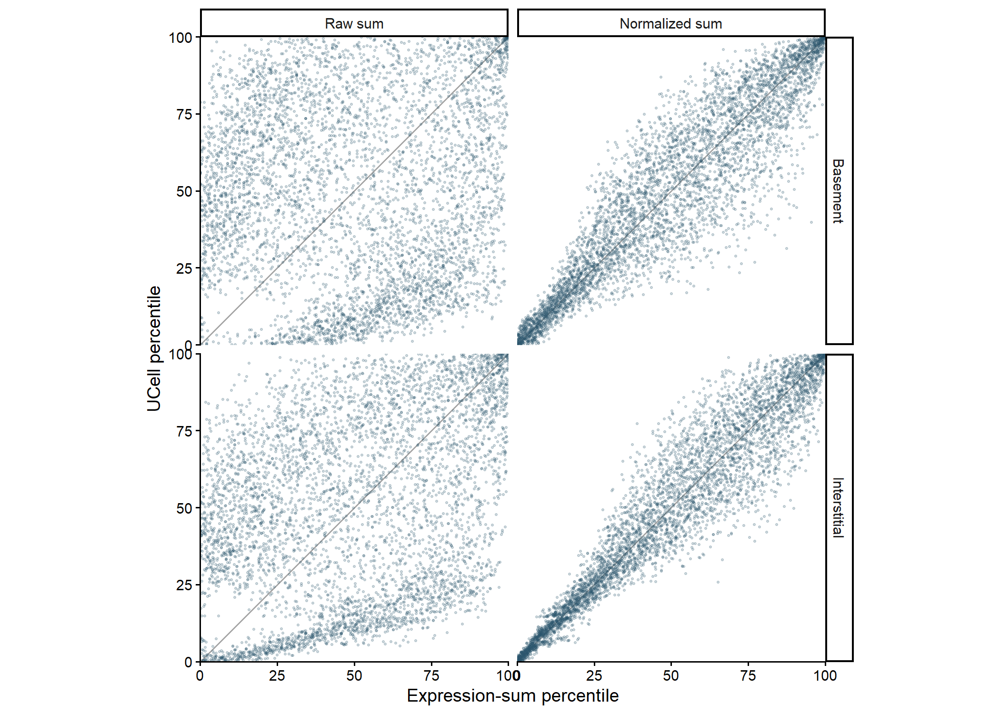
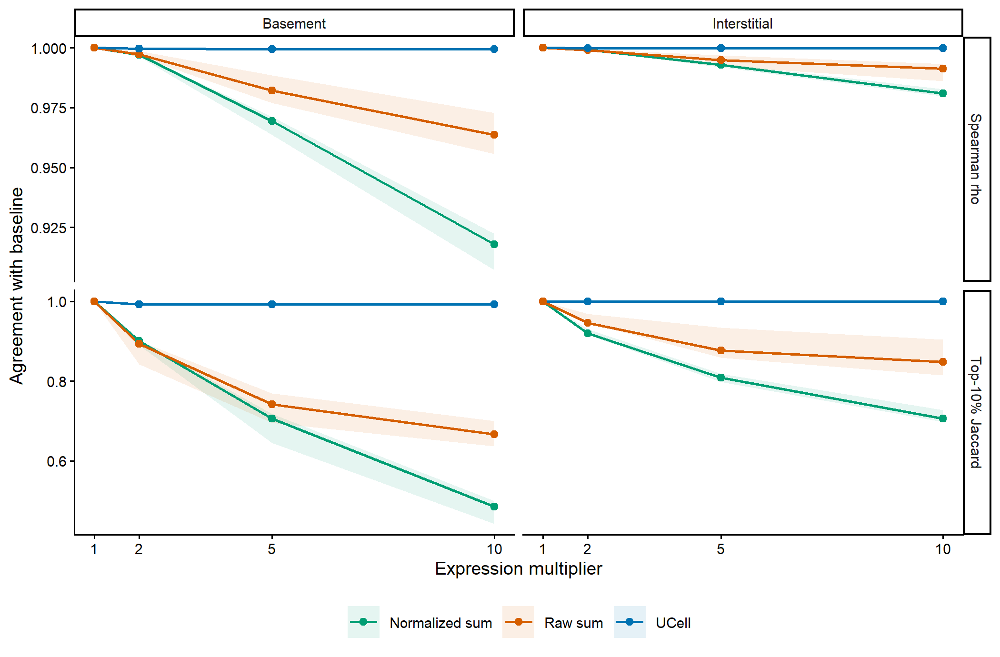
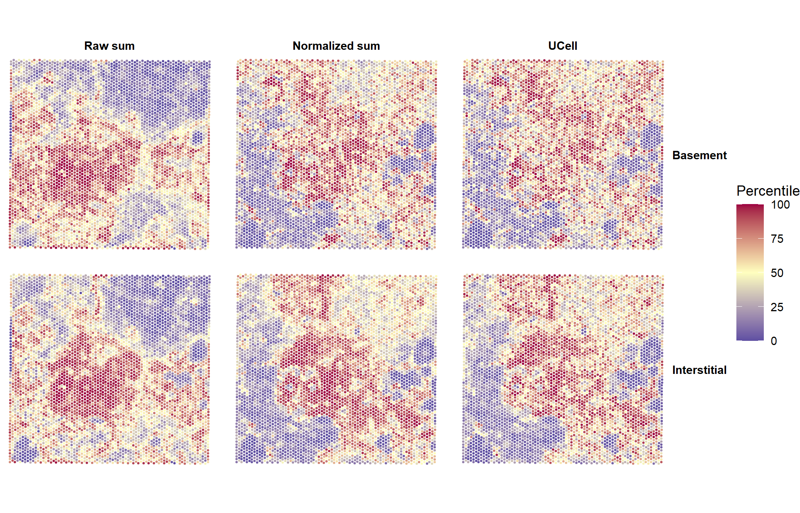

## Scores


``` r
seu <- readRDS(params$data_file)
niche_keys <- c("basement", "interstitial")
signature_labels <- c(basement = "Basement", interstitial = "Interstitial")
requested_signatures <- ecm_signatures[niche_keys]
signatures <- setNames(
  lapply(requested_signatures, intersect, y = rownames(seu)),
  unname(signature_labels[niche_keys])
)

signature_coverage <- do.call(rbind, lapply(niche_keys, function(niche_key) {
  signature <- unname(signature_labels[niche_key])
  data.frame(
    signature = signature,
    requested_genes = length(unique(requested_signatures[[niche_key]])),
    measured_genes = length(signatures[[signature]])
  )
}))
signature_coverage$coverage_fraction <-
  signature_coverage$measured_genes / signature_coverage$requested_genes

score_assay <- if ("SCT" %in% Assays(seu)) "SCT" else DefaultAssay(seu)
score_expression <- LayerData(seu, assay = score_assay, layer = "data")
raw_assay <- if ("Spatial" %in% Assays(seu)) "Spatial" else score_assay
raw_counts <- LayerData(seu, assay = raw_assay, layer = "counts")

seu <- score_ecm_niche_signatures(
  seu,
  niches = niche_keys,
  assay = score_assay,
  layer = "data",
  min_genes = 1,
  maxRank = 1500,
  overwrite = TRUE
)
niche_scores <- get_ecm_niche_signature_scores(seu, niches = niche_keys)
ucell <- as.data.frame(t(niche_scores[, colnames(seu), drop = FALSE]))
names(ucell) <- paste0(unname(signature_labels[rownames(niche_scores)]), "_UCell")

top_spots <- function(x, fraction = 0.10) {
  order(x, decreasing = TRUE)[seq_len(ceiling(length(x) * fraction))]
}

jaccard <- function(x, y) {
  length(intersect(x, y)) / length(union(x, y))
}

percentile <- function(x) {
  100 * (rank(x, ties.method = "average") - 1) / (length(x) - 1)
}

spot_scores <- do.call(rbind, lapply(names(signatures), function(signature) {
  genes <- signatures[[signature]]
  raw_genes <- intersect(genes, rownames(raw_counts))
  data.frame(
    spot_id = colnames(seu),
    signature = signature,
    ucell = ucell[[paste0(signature, "_UCell")]],
    normalized_sum = Matrix::colSums(score_expression[genes, , drop = FALSE]),
    raw_sum = Matrix::colSums(raw_counts[raw_genes, , drop = FALSE])
  )
}))

method_comparison <- do.call(rbind, lapply(split(spot_scores, spot_scores$signature), function(d) {
  data.frame(
    signature = d$signature[1],
    spots = nrow(d),
    spearman_ucell_vs_normalized_sum = cor(d$ucell, d$normalized_sum, method = "spearman"),
    spearman_ucell_vs_raw_sum = cor(d$ucell, d$raw_sum, method = "spearman"),
    top10_jaccard_ucell_vs_normalized_sum = jaccard(top_spots(d$ucell), top_spots(d$normalized_sum)),
    top10_jaccard_ucell_vs_raw_sum = jaccard(top_spots(d$ucell), top_spots(d$raw_sum))
  )
}))

write.csv(method_comparison, "results/method_comparison.csv", row.names = FALSE)
write.csv(signature_coverage, "results/signature_coverage.csv", row.names = FALSE)
spot_connection <- gzfile("results/spot_scores.csv.gz", open = "wt")
write.csv(spot_scores, spot_connection, row.names = FALSE)
close(spot_connection)

run_metadata <- data.frame(
  field = c(
    "seed", "spots", "genes", "score_assay", "raw_assay", "max_rank",
    "R", "matrispace", "Seurat", "UCell"
  ),
  value = c(
    264998, ncol(seu), nrow(seu), score_assay, raw_assay, 1500,
    as.character(getRversion()), as.character(packageVersion("matrispace")),
    as.character(packageVersion("Seurat")),
    as.character(packageVersion("UCell"))
  )
)
write.csv(run_metadata, "results/run_metadata.csv", row.names = FALSE)
method_comparison
```

```
##                 signature spots spearman_ucell_vs_normalized_sum
## Basement         Basement  4992                        0.9171755
## Interstitial Interstitial  4992                        0.9470387
##              spearman_ucell_vs_raw_sum top10_jaccard_ucell_vs_normalized_sum
## Basement                    0.05072014                             0.5432099
## Interstitial                0.33380346                             0.4771049
##              top10_jaccard_ucell_vs_raw_sum
## Basement                          0.1792453
## Interstitial                      0.2195122
```

## Comparison with expression sums


``` r
comparison_plot_data <- do.call(rbind, lapply(split(spot_scores, spot_scores$signature), function(d) {
  rbind(
    data.frame(signature = d$signature, method = "Normalized sum",
               expression_percentile = percentile(d$normalized_sum),
               ucell_percentile = percentile(d$ucell)),
    data.frame(signature = d$signature, method = "Raw sum",
               expression_percentile = percentile(d$raw_sum),
               ucell_percentile = percentile(d$ucell))
  )
}))

comparison_plot_data$signature <- factor(
  comparison_plot_data$signature,
  levels = c("Basement", "Interstitial")
)
comparison_plot_data$method <- factor(
  comparison_plot_data$method,
  levels = c("Raw sum", "Normalized sum")
)

ggplot(comparison_plot_data, aes(expression_percentile, ucell_percentile)) +
  geom_abline(slope = 1, intercept = 0, colour = "grey65", linewidth = 0.35) +
  geom_point(colour = "#28536B", alpha = 0.18, size = 0.35) +
  facet_grid(signature ~ method) +
  coord_equal(xlim = c(0, 100), ylim = c(0, 100), expand = FALSE) +
  labs(x = "Expression-sum percentile", y = "UCell percentile") +
  theme_classic(base_size = 9)
```



## Dominant-gene perturbation


``` r
perturbation <- list()
row_index <- 1

for (signature in names(signatures)) {
  genes <- signatures[[signature]]
  raw_genes <- intersect(genes, rownames(raw_counts))
  niche_key <- names(signature_labels)[match(signature, signature_labels)]
  dominant_genes <- head(
    raw_genes[order(Matrix::rowSums(score_expression[raw_genes, , drop = FALSE]), decreasing = TRUE)],
    3
  )

  baseline <- spot_scores[spot_scores$signature == signature, ]

  for (gene in dominant_genes) {
    for (multiplier in c(2, 5, 10)) {
      changed_expression <- score_expression
      changed_expression[gene, ] <- changed_expression[gene, ] * multiplier

      changed_seu <- seu
      LayerData(changed_seu, assay = score_assay, layer = "data") <- changed_expression
      changed_seu <- score_ecm_niche_signatures(
        changed_seu,
        signatures = setNames(list(genes), niche_key),
        assay = score_assay,
        layer = "data",
        min_genes = 1,
        maxRank = 1500,
        overwrite = TRUE
      )
      changed_ucell <- as.numeric(
        get_ecm_niche_signature_scores(changed_seu, niches = niche_key)[
          niche_key, colnames(seu)
        ]
      )

      changed_normalized_sum <- baseline$normalized_sum +
        (multiplier - 1) * as.numeric(score_expression[gene, ])
      changed_raw_sum <- baseline$raw_sum +
        (multiplier - 1) * as.numeric(raw_counts[gene, ])

      changed_scores <- list(
        UCell = changed_ucell,
        `Normalized sum` = changed_normalized_sum,
        `Raw sum` = changed_raw_sum
      )
      baseline_scores <- list(
        UCell = baseline$ucell,
        `Normalized sum` = baseline$normalized_sum,
        `Raw sum` = baseline$raw_sum
      )

      for (method in names(changed_scores)) {
        perturbation[[row_index]] <- data.frame(
          signature = signature,
          gene = gene,
          multiplier = multiplier,
          method = method,
          spearman = cor(baseline_scores[[method]], changed_scores[[method]], method = "spearman"),
          top10_jaccard = jaccard(
            top_spots(baseline_scores[[method]]),
            top_spots(changed_scores[[method]])
          )
        )
        row_index <- row_index + 1
      }
    }
  }
}

perturbation <- do.call(rbind, perturbation)
write.csv(perturbation, "results/perturbation_results.csv", row.names = FALSE)
```


``` r
perturbation_long <- rbind(
  data.frame(perturbation[c("signature", "gene", "multiplier", "method")],
             metric = "Spearman rho", value = perturbation$spearman),
  data.frame(perturbation[c("signature", "gene", "multiplier", "method")],
             metric = "Top-10% Jaccard", value = perturbation$top10_jaccard)
)

summary_groups <- split(
  perturbation_long,
  interaction(perturbation_long$signature, perturbation_long$method,
              perturbation_long$multiplier, perturbation_long$metric, drop = TRUE)
)
perturbation_summary <- do.call(rbind, lapply(summary_groups, function(d) {
  data.frame(
    signature = d$signature[1], method = d$method[1],
    multiplier = d$multiplier[1], metric = d$metric[1],
    median = median(d$value), minimum = min(d$value), maximum = max(d$value)
  )
}))

baseline <- expand.grid(
  signature = c("Basement", "Interstitial"),
  method = c("UCell", "Normalized sum", "Raw sum"),
  metric = c("Spearman rho", "Top-10% Jaccard")
)
baseline$multiplier <- 1
baseline$median <- baseline$minimum <- baseline$maximum <- 1
perturbation_summary <- rbind(perturbation_summary, baseline)
write.csv(perturbation_summary, "results/perturbation_summary.csv", row.names = FALSE)

method_colours <- c(UCell = "#0072B2", `Normalized sum` = "#009E73", `Raw sum` = "#D55E00")

ggplot(perturbation_summary,
       aes(multiplier, median, colour = method, fill = method, group = method)) +
  geom_ribbon(aes(ymin = minimum, ymax = maximum), alpha = 0.10, colour = NA) +
  geom_line(linewidth = 0.6) +
  geom_point(size = 1.5) +
  facet_grid(metric ~ signature, scales = "free_y") +
  scale_x_continuous(breaks = c(1, 2, 5, 10)) +
  scale_colour_manual(values = method_colours) +
  scale_fill_manual(values = method_colours) +
  labs(x = "Expression multiplier", y = "Agreement with baseline", colour = NULL, fill = NULL) +
  theme_classic(base_size = 9) +
  theme(legend.position = "bottom")
```



## Spatial comparison


``` r
coordinates <- GetTissueCoordinates(seu)
coordinate_table <- data.frame(
  spot_id = rownames(coordinates),
  x = coordinates$x,
  y = -coordinates$y
)

spatial_plot_data <- do.call(rbind, lapply(split(spot_scores, spot_scores$signature), function(d) {
  rbind(
    data.frame(spot_id = d$spot_id, signature = d$signature,
               method = "Raw sum", score = percentile(d$raw_sum)),
    data.frame(spot_id = d$spot_id, signature = d$signature,
               method = "Normalized sum", score = percentile(d$normalized_sum)),
    data.frame(spot_id = d$spot_id, signature = d$signature,
               method = "UCell", score = percentile(d$ucell))
  )
}))
spatial_plot_data <- merge(spatial_plot_data, coordinate_table, by = "spot_id", sort = FALSE)
spatial_plot_data$signature <- factor(spatial_plot_data$signature, c("Basement", "Interstitial"))
spatial_plot_data$method <- factor(spatial_plot_data$method, c("Raw sum", "Normalized sum", "UCell"))

ggplot(spatial_plot_data, aes(x, y, colour = score)) +
  geom_point(size = 0.42) +
  facet_grid(signature ~ method) +
  coord_equal() +
  scale_colour_gradient2(
    low = "#5E4FA2", mid = "#FFFFBF", high = "#9E0142",
    midpoint = 50, limits = c(0, 100), name = "Percentile"
  ) +
  theme_void(base_size = 9) +
  theme(strip.text = element_text(face = "bold"), legend.position = "right")
```



## Session information


``` r
sessionInfo()
```

```
## R version 4.5.3 (2026-03-11 ucrt)
## Platform: x86_64-w64-mingw32/x64
## Running under: Windows 11 x64 (build 26200)
##
## Matrix products: default
##   LAPACK version 3.12.1
##
## locale:
## [1] C
## system code page: 65001
##
## time zone: Europe/Helsinki
## tzcode source: internal
##
## attached base packages:
## [1] stats     graphics  grDevices utils     datasets  methods   base
##
## other attached packages:
## [1] Seurat_5.5.0       SeuratObject_5.4.0 sp_2.2-1           Matrix_1.7-4
## [5] matrispace_0.3.0   ggplot2_4.0.3
##
## loaded via a namespace (and not attached):
##   [1] RColorBrewer_1.1-3          UCell_2.14.0
##   [3] jsonlite_2.0.0              magrittr_2.0.5
##   [5] spatstat.utils_3.2-3        farver_2.1.2
##   [7] vctrs_0.7.3                 ROCR_1.0-12
##   [9] spatstat.explore_3.8-0      htmltools_0.5.9
##  [11] S4Arrays_1.10.1             BiocNeighbors_2.4.0
##  [13] SparseArray_1.10.10         sctransform_0.4.3
##  [15] parallelly_1.47.0           KernSmooth_2.23-26
##  [17] htmlwidgets_1.6.4           ica_1.0-3
##  [19] plyr_1.8.9                  plotly_4.12.0
##  [21] zoo_1.8-15                  igraph_2.3.1
##  [23] mime_0.13                   lifecycle_1.0.5
##  [25] pkgconfig_2.0.3             R6_2.6.1
##  [27] fastmap_1.2.0               MatrixGenerics_1.22.0
##  [29] fitdistrplus_1.2-6          future_1.70.0
##  [31] shiny_1.13.0                digest_0.6.39
##  [33] patchwork_1.3.2             S4Vectors_0.48.1
##  [35] tensor_1.5.1                RSpectra_0.16-2
##  [37] irlba_2.3.7                 GenomicRanges_1.62.1
##  [39] labeling_0.4.3              progressr_0.19.0
##  [41] spatstat.sparse_3.2-0       httr_1.4.8
##  [43] polyclip_1.10-7             abind_1.4-8
##  [45] compiler_4.5.3              withr_3.0.2
##  [47] S7_0.2.2                    BiocParallel_1.44.0
##  [49] fastDummies_1.7.6           MASS_7.3-65
##  [51] DelayedArray_0.36.1         tools_4.5.3
##  [53] lmtest_0.9-40               otel_0.2.0
##  [55] httpuv_1.6.17               future.apply_1.20.2
##  [57] goftest_1.2-3               glue_1.8.1
##  [59] nlme_3.1-168                promises_1.5.0
##  [61] grid_4.5.3                  Rtsne_0.17
##  [63] cluster_2.1.8.2             reshape2_1.4.5
##  [65] generics_0.1.4              gtable_0.3.6
##  [67] spatstat.data_3.1-9         tidyr_1.3.2
##  [69] data.table_1.18.4           XVector_0.50.0
##  [71] BiocGenerics_0.56.0         spatstat.geom_3.8-1
##  [73] RcppAnnoy_0.0.23            ggrepel_0.9.8
##  [75] RANN_2.6.2                  pillar_1.11.1
##  [77] stringr_1.6.0               spam_2.11-3
##  [79] RcppHNSW_0.6.0              later_1.4.8
##  [81] splines_4.5.3               dplyr_1.2.1
##  [83] lattice_0.22-9              survival_3.8-6
##  [85] deldir_2.0-4                tidyselect_1.2.1
##  [87] SingleCellExperiment_1.32.0 miniUI_0.1.2
##  [89] pbapply_1.7-4               knitr_1.51
##  [91] gridExtra_2.3               IRanges_2.44.0
##  [93] Seqinfo_1.0.0               SummarizedExperiment_1.40.0
##  [95] scattermore_1.2             stats4_4.5.3
##  [97] xfun_0.57                   Biobase_2.70.0
##  [99] matrixStats_1.5.0           stringi_1.8.7
## [101] lazyeval_0.2.3              yaml_2.3.12
## [103] evaluate_1.0.5              codetools_0.2-20
## [105] tibble_3.3.1                cli_3.6.6
## [107] uwot_0.2.4                  xtable_1.8-8
## [109] reticulate_1.46.0           dichromat_2.0-0.1
## [111] Rcpp_1.1.1-1.1              globals_0.19.1
## [113] spatstat.random_3.4-5       png_0.1-9
## [115] spatstat.univar_3.2-0       parallel_4.5.3
## [117] dotCall64_1.2               listenv_0.10.1
## [119] viridisLite_0.4.3           scales_1.4.0
## [121] ggridges_0.5.7              purrr_1.2.2
## [123] rlang_1.2.0                 cowplot_1.2.0
```
